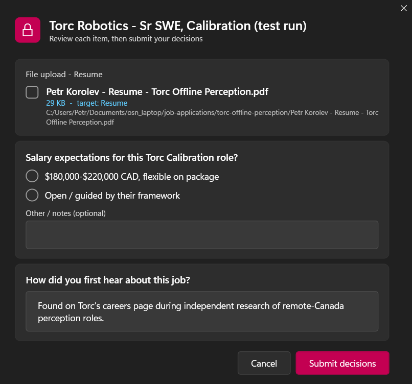
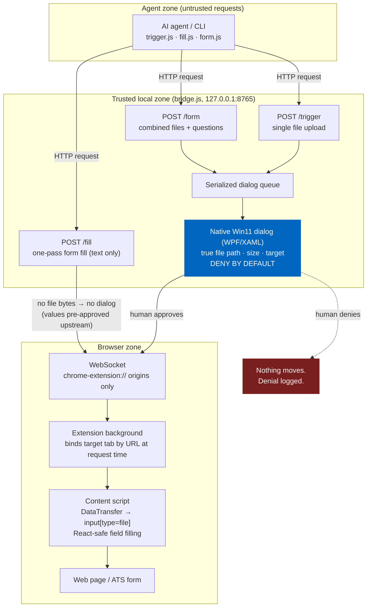

# Upload Bridge

Human-in-the-loop consent for agentic browser automation: file uploads, one-pass form filling, and native approval forms.

AI agents that drive a browser (filling job applications, submitting forms) inevitably hit `<input type="file">`. Letting a model push arbitrary local files into arbitrary webpages is unsafe: a compromised or prompt-injected agent could exfiltrate any file it can name. Upload Bridge closes that gap. The agent may **request** an upload, but bytes only move after a **human approves in a native Windows 11 dialog** rendered by trusted local code — showing the true resolved file path, size, and target field, deny-by-default.



*The combined approval form: file uploads (unchecked = denied) and agent questions, answered in one native window with a real Mica backdrop and the user's system accent color.*

## Architecture



The load-bearing edge is `D → WS`: **file bytes cross into the browser only through a human click in UI the agent cannot draw or click.**

## The trust model

This is the whole point of the project:

- **The model can request, never consent.** The agent's only capability is asking. It cannot render, click, or bypass the approval UI.
- **Trusted UI shows the true object.** The dialog is drawn by local code the agent does not control, and it displays the *resolved* file path and size — not whatever the agent claims it is uploading. A prompt-injected agent cannot misrepresent an upload.
- **Deny by default.** Single-file dialog: Deny holds focus, Enter/Esc denies, and timeouts deny. Combined form: every file checkbox starts **unchecked**; Esc cancels everything.
- **No skip-dialog flag, by design.** There is deliberately no environment variable, config option, or CLI flag that suppresses the dialog.
- **Per-file consent, no standing grants.** Every upload requires a fresh approval. Approving one file never authorizes the next.
- **Injection-safe by construction.** Request data reaches PowerShell Base64-encoded and is assigned to `Text` properties after XAML parsing — hostile filenames cannot inject code or markup.
- **Audit log.** Every request, approval, and denial is appended to `uploads.log` with a timestamp.

Text-only form filling (`/fill`) carries no file-exfiltration risk, so it skips the dialog; values are expected to be human-approved upstream in the agent's own confirmation flow, and every fill is still logged.

## Setup

1. `npm install`
2. `node bridge.js` (or `npm start`) — listens on `127.0.0.1:8765`
3. In a Chromium browser (Chrome, Vivaldi, Edge, Brave): open `chrome://extensions`, enable Developer mode, **Load unpacked**, select the `extension/` folder.
4. Edit `extension/manifest.json` `host_permissions` and `content_scripts.matches` to the sites you actually use. The shipped list targets common ATS domains; **trim it to your own targets.**

## Usage

**Single file upload** (native approval dialog appears):

```
node trigger.js "C:\Users\you\Documents\resume.pdf" "Resume" "greenhouse.io/company"
```

Args: file path, target-field hint (matched against label text near the file input), optional URL substring that picks the destination tab.

**One-pass form fill** (no dialog; text values only):

```
node fill.js plan.json
```

```json
{
  "targetUrl": "greenhouse.io/company",
  "fields": [
    { "label": "First Name", "value": "Ada" },
    { "label": "Country", "value": "Canada", "commit": true }
  ]
}
```

`commit: true` nudges combobox-style fields with ArrowDown+Enter after typing. The content script reports `filled N/N fields` in an on-page toast.

**Combined approval form** (one window: file approvals + questions for the human):

```
node form.js spec.json
```

```json
{
  "title": "Acme Corp application",
  "targetUrl": "greenhouse.io/acme",
  "items": [
    { "kind": "file",   "label": "Resume", "path": "C:/docs/resume.pdf", "target": "Resume" },
    { "kind": "choice", "id": "salary", "question": "Salary expectations?",
      "options": ["$150k-$180k", "Open"], "other": true },
    { "kind": "text",   "id": "notes", "question": "Anything else?" }
  ]
}
```

Returns the human's decisions as JSON (`{ cancelled, answers, files, dispatched }`) and dispatches approved files.

**MCP server** (recommended for agents): expose the bridge as first-class MCP tools — `upload_file`, `fill_form`, `request_decisions`, `bridge_health` — with the human-consent layer unchanged underneath:

```
claude mcp add upload-bridge -- node /path/to/upload-bridge/mcp-server.mjs
```

or in a project `.mcp.json`:

```json
{ "mcpServers": { "upload-bridge": { "command": "node", "args": ["/path/to/upload-bridge/mcp-server.mjs"] } } }
```

**OpenAPI:** the full HTTP API is specified in [`openapi.yaml`](openapi.yaml) for any non-MCP integration.

**Roadmap:** see [`ROADMAP.md`](ROADMAP.md) — the project is growing from file-upload consent into a general governance layer for agentic browsing (governed action classes, per-origin policies, signed audit receipts).

**The protocol:** the pattern this tool implements is being standardized as the [Consent Request Protocol (CRP)](https://github.com/realitymatrix/consent-request-protocol) — a small, transport-neutral spec (JSON schemas included) for agent-requested, human-approved, receipt-producing actions. Upload Bridge is its reference implementation.

**Health check:**

```
curl http://127.0.0.1:8765/health
# {"ok":true,"extensionConnected":true}
```

Supported file types: pdf, doc, docx, txt, rtf.

## Security notes and known limitations

- **The localhost endpoints are unauthenticated.** Any local process can *request* — but every file request still faces the human dialog showing the true file. Requesting is cheap; consent is not.
- **WebSocket connections are restricted to `chrome-extension://` origins**, so web pages cannot connect and receive file bytes.
- The destination tab is bound **at request time**, preferring the tab whose URL matches `targetUrl` — the user can read anything else while the agent works.
- The extension keeps its service worker alive via `chrome.alarms` (~24s); after a browser restart give it a moment and check `/health`.
- The content script only attaches to pages loaded **after** the extension is installed/reloaded; refresh existing tabs.
- Windows-only dialogs for now (WPF via PowerShell).

## Roadmap

- MCP-server wrapper so agents can use it as a first-class tool
- Per-origin allowlists (bind approvals to the target site, shown in the dialog)
- One-time request tokens for the localhost endpoints
- macOS (osascript) and Linux (zenity) approval dialogs

## Why this exists

Agentic automation is only safe when consent is bound to the true object, in UI the model cannot draw or click. Upload Bridge was designed so that even a fully compromised or prompt-injected agent cannot misrepresent an upload: the human sees the actual resolved file in a trusted native dialog, and nothing moves without their click.

## License

MIT — see [LICENSE](LICENSE).
